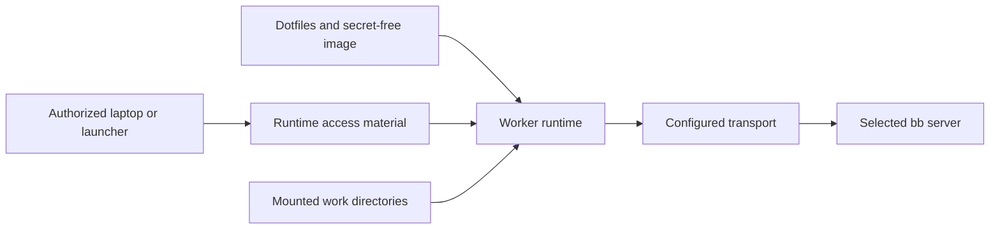

# Service and worker provisioning

Date: 2026-10-03

This note records provisioning requirements and configuration choices. It does not implement provisioning commands. Chezmoi excludes `agent-docs/` from the target home directory.

## Shared provisioning contract

Use the same worker image and provisioning flow for every bb server. Keep server addresses, transport configuration, and credential references outside the image. Do not add server-specific branches to the worker bootstrap.

Keep deployment identities, addresses, access policies, and private configuration outside this repository. Dotfiles contain tools, public trust certificates, configuration templates, and bootstrap scripts. Private keys and credentials belong in 1Password or runtime secret delivery.

Separate installation from enrollment. `chezmoi apply` must not consume enrollment credentials, allocate workers, or grant access to a server.

## Kubernetes client configuration

The default kubeconfig path is `~/.kube/config`. A context selects a cluster, a user, and an optional namespace. The current repository installs `kubectl` but does not manage kubeconfig.

The Tailscale API proxy can authenticate requests through the caller's Tailscale identity. In this mode, the generated kubeconfig contains endpoint information and a placeholder token. It does not need a Kubernetes client key. Other kubeconfig formats can contain credentials.

Access requires both Tailscale network permission and Kubernetes role-based access control (RBAC). A copied context does not grant the caller another user's identity. Kubernetes role bindings define the permitted operations.

### Register and select a context

Use the hostname of an authorized Tailscale API proxy:

```sh
cluster_hostname=cluster.example-tailnet.ts.net
tailscale configure kubeconfig "$cluster_hostname"
kubectl config get-contexts
kubectl config use-context "$cluster_hostname"
kubectl config current-context
```

The registration command changes the current context. Future provisioning must preserve the previous context unless the caller requests a switch.

Use an explicit context for automation:

```sh
kubectl --context="$cluster_hostname" get nodes
```

Generate contexts from local endpoint configuration. Do not commit generated kubeconfigs or distribute a cluster administrator's credentials to workers. Workers need Kubernetes permissions only for tasks that use Kubernetes.

## k3s host provisioning

k3s can host container services. A systemd service can run bb without Kubernetes. A shared nginx deployment can route requests to bb and other services.

The provisioning inputs include:

- A pinned k3s release and node identity.
- The node address, API bind address, and certificate names.
- Pod and service address ranges that do not overlap existing networks.
- A storage location and backup policy.
- The ingress controller, load balancer, and NodePort exposure policy.
- DNS resolver configuration and Tailscale startup dependencies.

For Tailscale-only administration, bind the API to the Tailscale address. Restrict NodePorts to the intended interface. If another deployment owns ingress ports, disable bundled Traefik and ServiceLB. Enable encryption at rest for Kubernetes Secrets. Keep the local administrator kubeconfig private.

Inherited DNS search suffixes can change external hostname lookups. Provisioning must check pod DNS and outbound TLS without disabling certificate validation. A resolver file can retain upstream DNS servers without unrelated search suffixes.

## Tailscale exposure choices

| Choice | Use |
|---|---|
| Node address | Direct access to selected ports through Tailscale network rules. |
| Tailscale Serve | Private HTTPS access to a service on the host. |
| Named Tailscale Service | A stable service identity independent of its host. Registration and host approval are required. |
| Kubernetes operator | Expose selected Kubernetes Services or Ingress resources and provide an authenticated API proxy. |

A Tailscale HTTPS certificate provides server identity and encryption. Tailscale network rules control connectivity. Kubernetes RBAC controls API operations. Public Funnel exposure is outside this provisioning contract.

Operator credentials belong in 1Password and runtime Kubernetes Secrets. Dotfiles must not contain their values. Worker identities and permissions must remain separate from the operator's provisioning credentials.

## Ephemeral workers and containers

The shared flow is:



Provisioning must accept the server URL, transport configuration, workspace mounts, and runtime credential references as inputs. Provider credentials remain separate from bb enrollment. GitHub access follows the repository's existing `gh` authentication policy.

For certificate-based access, each worker generates its own private key. The authorized launcher approves its certificate request. Public CA certificates can be part of the image. Private keys, client certificates, and enrollment credentials arrive or originate at runtime. Workers must not receive CA signing keys or broad vault access.

Work directories and worker identity have separate lifetimes. A new disposable worker receives a new identity. Process restarts within that lifetime can retain runtime identity state. The container supervisor runs the daemon in the foreground.

The requested bb lifecycle retains connected workers and removes their active registration after a disconnection grace period. Reconnection within that period cancels removal. Expiration must revoke access without deleting mounted work directories or thread history.

This lifecycle remains pending bb work. Existing manually enrolled machines do not implement this disconnection policy. The existing provider policy removes thread-scoped ephemeral compute after its live threads are gone.

## Pending transport and lifecycle work

The provisioning contract is shared, but transport authentication is not identical for every endpoint. Tailscale identity and HTTPS client certificates require different access material. These differences belong in transport configuration, not separate worker images or bootstrap flows.

- Open question: does bb support client certificates throughout enrollment, HTTP, and WebSocket connections, or does transport need a local proxy?
- Open question: what worker certificate lifetime, renewal rules, and immediate revocation mechanism will provisioning use?
- Open question: what disconnection grace period will bb enforce, including after server restarts?

Kubernetes access, transport access, and bb enrollment are separate grants. A worker that only runs bb tasks does not need Kubernetes administrator access.

## References

- [Tailscale API proxy authentication and RBAC](https://tailscale.com/docs/kubernetes-operator/api-server-access/auth-and-rbac)
- [Tailscale Kubernetes operator](https://tailscale.com/docs/kubernetes-operator)
- [Tailscale Serve](https://tailscale.com/docs/features/tailscale-serve)
- [k3s server configuration](https://docs.k3s.io/cli/server)
- [k3s Secrets encryption](https://docs.k3s.io/security/secrets-encryption)

## 2026-10-03 addendum: certificate renewal

[Worker client certificates](worker-certificates.md) documents the implemented `bb-worker-cert` command. It supports SSH renewal and a copy/paste signing exchange. Signing profiles and worker activation profiles remain outside the repository. The worker keeps its private key in memory-backed storage; only the signing machine requires 1Password access.

This command renews transport credentials. BB enrollment, proxy installation, provider login delivery, a guaranteed fresh approval challenge, and disconnect-based worker retirement remain separate work.
