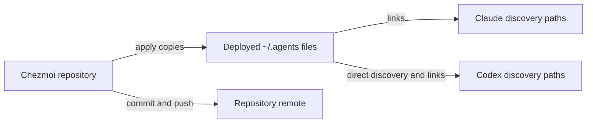

# Workstation environment

This guide serves Claude and Codex. It describes capabilities provided by the dotfiles and separately installed tooling. Availability depends on the host and execution shell.

## Discover before use

Read this guide once per session. For the current task, read the relevant skill and command help. Use `command -v <name>` to check an executable on the host that will run it. Installed files and PATH entries do not establish authentication or service connectivity.

Shell aliases and Fish functions are not portable commands. Prefer the executable forms below in agent shells. Do not install or upgrade a missing tool merely to inspect its documentation. Report missing prerequisites when they block the task.

## Capabilities

| Task | Tool and entry point | Prerequisites and scope |
|---|---|---|
| Inspect or manage BB projects, machines, and conversations | Read the `bb-cli` skill. Use `bb --help`, `bb guide`, and `bb <group> --help`. | Requires an installed CLI. State queries also require the intended server and authentication. |
| Inject credentials into one process | `openv <command...>` or `openv-file <env-reference-file> <command...>` | Requires `op`, access to 1Password, and an env-reference file. Never invoke an environment dump to check secrets. |
| Inspect and manage repository worktrees | `git worktree list`; `wt ls`; `wt path <name>` | `wt` manages `.claude/worktrees/`. `wt new <name> [base-ref]` creates a `wt/<name>` branch. Use explicit Git commands when a different branch or path is required. |
| Launch a terminal agent session | `agent-spawn claude` or `agent-spawn codex`; inspect the script usage for worktree and prompt arguments | Requires Zellij and the selected CLI. Launch only as part of authorized agent work. Autonomous modes change permission behavior; inspect them before use. |
| Inspect terminal agent/worktree status | `agent-status` | Scans the current repository and repositories under `~/src`. Process-name matches are hints, not proof of session health. Requires Bash with associative arrays. |
| Request an independent model check | Read the `phone-a-friend` skill and use its runner | Requires its runtime, adapter, and backend authentication. Its verification mode selects planning mode; this is not a strict filesystem write barrier. |
| Open a remote development session | `dev-remote [host] [session]`; `dev-remote refresh [host] [session]` | Uses SSH forwarding and the remote session helper. Can inject credentials and create or refresh a session. Read the source and README before changing remote state. |
| Check GitHub access and signing configuration | `gh auth status`; `git-signing-status` | Use `gh` for GitHub credentials. Signing status checks configuration; a successful commit verifies signing. |
| Install or update an agent CLI | `iou_claude`, `iou_codex`, `iou_cursor`, `iou_antigravity`, `iou_pi` | These change installed software. Use only for an authorized install or update. See the source README's Updating section. |

Fish provides convenience functions such as `cc`, `cx`, `ws`, `wnew`, `wrm`, `wcd`, `as`, and `ast`. `wt cd` is also a Fish function. In other shells, use the executable or change directory to the result of `wt path <name>`.

The `headless-nosudo` profile excludes `wt`, `agent-spawn`, `agent-status`, and the related Fish shortcuts. Shared instructions and skills still deploy. No-sudo installations can use architecture-specific directories under `~/.local/<arch>/`; do not hardcode one machine's PATH into another.

## BB: use and ownership

The `bb-cli` skill describes BB workflows; the installed CLI's help describes its current interface. Start a state task with `bb status --json` when context is not established. Use the relevant list command to check actual access. Help output alone does not prove connectivity.

Common read commands are `bb project list --json`, `bb machine list --json`, and `bb thread list --json`. Read live help for filters and selectors. Resolve IDs before mutations. Preserve the established server and machine selection; do not switch targets to bypass a connection error.

BB owns its CLI launcher and the installed `bb-cli` skill. They are not part of the chezmoi skill roster. In a BB source checkout, the skill lives at `plugins/bb-guide/skills/bb-cli/`. Find that checkout instead of assuming it is under `~/repos`.

For skill deployment, inspect `bb skill cli-skills-status --help` and `bb skill install-cli-skills --help`. Select the intended machine explicitly for installation. Update the owning source and release first; reinstalling from an unchanged server does not publish local edits. Check the installed result against the intended version. The checkout and installed release can differ.

## Source ownership

Discover the active dotfiles source with `chezmoi source-path`. Resolve symlinks before calling `chezmoi source-path <target>`: the linker-created agent-home paths are not directly tracked targets.

| Installed surface | Editable source or owner |
|---|---|
| `~/.agents/AGENTS.md`, `~/.agents/ENVIRONMENT.md` | `dot_agents/AGENTS.md`, `dot_agents/ENVIRONMENT.md` in the chezmoi repository |
| Rostered `~/.agents/skills/<name>/` | `dot_agents/skills/<name>/`; roster in `.chezmoidata/agent_skills.yaml` |
| `~/.claude/CLAUDE.md`, `~/.codex/AGENTS.md`, rostered agent-home skill links | `run_onchange_after_link-agent-scaffold.sh.tmpl` creates links to the deployed `~/.agents` tree |
| Managed `~/.local/bin` commands | `dot_local/bin/executable_<name>` or its `.tmpl` form; confirm with `chezmoi source-path` |
| Managed shell configuration | `dot_config/fish/` and `dot_profile.tmpl`; confirm each target's mapping |
| BB launcher and `bb-cli` skill | BB project and installer; see the BB section |
| Plugin cache, bundled system skills, credentials, session history | Owning application or plugin manager. Do not patch caches or commit runtime state. |
| Other files or plugins | Determine the actual owner. A failed chezmoi lookup does not identify an alternative source. |

Codex can discover user skills directly under `~/.agents/skills`. The scaffold also maintains per-skill links for both agents. Preserve those links until the supported launch paths are tested. A skill catalog exposes descriptions; read the relevant `SKILL.md` for the procedure.

## Update a managed capability

1. Find the owner and source mapping. Read the source repository's instructions, Git status, worktrees, and relevant documentation.
2. Inspect target drift with scoped `chezmoi status <target>`. Preserve user edits. Do not run a broad apply to clear unrelated differences.
3. Edit source files. Keep `.tmpl`, `executable_`, and other chezmoi attributes in source names. For behavior changes, write the failing test before the fix.
4. Update this capability guide when the user-facing workflow changes. Keep skill references, metadata, and source README consistent.
5. Run relevant checks under `timeout 300` for targeted suites. For scripts, use test fixtures rather than real credentials or services where possible.
6. Preview with `chezmoi diff --recursive <target>...` and `chezmoi apply --dry-run <target>...`. Inspect any scheduled scripts. If using a separate worktree, pass `--source <worktree>` to every chezmoi preview and apply command.
7. Apply the same explicit targets. Check scoped status, deployed contents, executable modes, and relevant links. For templates, compare against rendered output rather than raw source.
8. Check discovery and use in fresh Claude and Codex sessions. Distinguish startup context, on-demand file reads, successful commands, and service access.
9. Commit only the intended source changes and push the working branch. Use draft PRs for non-trivial changes. Report the commit, branch, deployment result, and any unfinished step.

A content-only skill edit needs an apply but no relink. To add a shared skill, create its source directory and add its name to the roster. Roster changes also require the linker script to run; file-only applies do not establish link installation. Preview that script explicitly before running it. To remove a skill, inspect both deployed files and links; removing a roster entry only prunes scaffold-owned links.

## Deeper references

The source repository's `README.md` covers installation, profiles, credentials, remote sessions, and updates. `agent-docs/` holds design and evaluation evidence. Those files stay in the source repository; they are not deployed into the home directory.

Read the relevant source in `dot_local/bin/` before using a helper whose interface has no help flag. Read `dot_config/fish/conf.d/agent-aliases.fish` for shortcut definitions. Use plugin-specific skills and supported manager commands for plugin operations.
